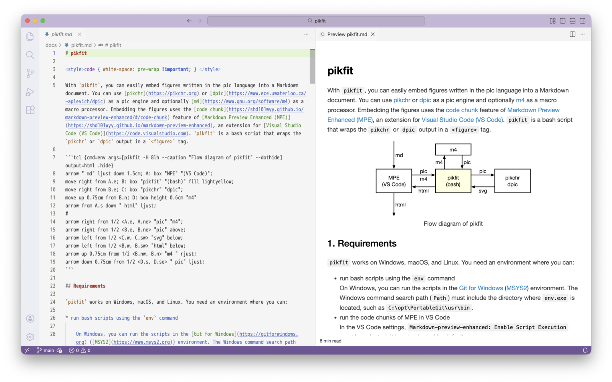

# pikfit

With `pikfit`, you can easily embed figures written in the pic language into a Markdown document. You can use [pikchr](https://pikchr.org) or [dpic](https://www.ece.uwaterloo.ca/~aplevich/dpic) as a pic engine and optionally [m4](https://www.gnu.org/software/m4) as a macro processor. Embedding the figures uses the [code chunk](https://shd101wyy.github.io/markdown-preview-enhanced/#/code-chunk) feature of [Markdown Preview Enhanced (MPE)](https://shd101wyy.github.io/markdown-preview-enhanced), an extension for [Visual Studio Code (VS Code)](https://code.visualstudio.com). `pikfit` is a bash script that wraps `pikchr` or `dpic` output in a `<figure>` tag.



## Requirements

`pikfit` works on Windows, macOS, and Linux. You need an environment where you can:

* run bash scripts using the `env` command
* run the code chunks of MPE in VS Code
* run the `pikchr` or `dpic` command
* run the `m4` command if you use macros

## Installation

Copy the `pikfit` file to an installation directory and give execute permission to it. For example, if the installation directory is `$HOME/bin`, run the following on the command line.

```console
$ cp pikfit ~/bin
$ chmod +x ~/bin/pikfit
```

The installation directory, such as `$HOME/bin` or `/usr/local/bin`, must be included in the shell command search path (`PATH`). On Windows, you must add the installation directory, such as `%USERPROFILE%\bin` or `C:\opt\PortableGit\usr\local\bin`, to the Windows command search path (`Path`). The value of `Path` will then be included in the shell command search path (`PATH`).

## Usage

Open a Markdown document in VS Code. Write and run MPE code chunks calling `pikfit`.

### Writing a code chunk

In the options of a code chunk:

* Set `cmd` to `env`
* Set `args` to `pikfit` and its options
* Set `output` to `html`

In the following example, the option `-H 3lh` is added to `args` to set the figure height to three times the line height.

````markdown
``` {cmd=env args=[pikfit -H 3lh] output=html}
line; box "Hello!"; arrow; # pic code here
```
````

### Running the code chunk

Preview the document with `Open Preview to the Side` in VS Code. Run the code chunk with `Run Code Chunk` ( <kbd>▶︎</kbd> button) or `Run All Code Chunks` ( <kbd>ALL</kbd> button).

## Examples

### Width and height

By default, `pikfit` draws figures at full width with `pikchr` and at original size with `dpic`. Specifying `-W`*`WIDTH`* or `-H`*`HEIGHT`* changes the figure size. You can use CSS (Cascading Style Sheets) units, such as `%`, `em`, and `lh`, for the width and height values.

````markdown
``` {cmd=env args=[pikfit -W 10em -H 5lh] output=html}
line; box "Hello!"; arrow;
```
````

Extra spaces around the figure may be added to keep its aspect ratio if you specify both the width and height.

### Alignment

If a figure is narrower than the full width, you can align the figure with the `-A`*`ALIGN`* option, such as `-A R` to align right. You can use `L` for left, `C` for center, and `R` for right.

````markdown
``` {cmd=env args=[pikfit -H 3lh -A L] output=html}
line; box "Hello!"; arrow;
```
````

### Caption

You can set a caption to a figure with `--caption`*`TEXT`*. Specifying `--caption-wrap` wraps caption text to fit the figure width, which must be specified with `-W`*`WIDTH`*. The `--caption-align`*`ALIGN`* and `--caption-text-align`*`ALIGN`* options allow you to align the caption and its text. Specifying `--caption-top` puts the caption above the figure.

````markdown
``` {cmd=env args=[pikfit -W 16em -A R --caption "Simple example" --caption-wrap --caption-align C] output=html}
line; box "Hello!"; arrow;
```
````

### dpic

You can use `dpic` as a pic engine with `--dpic`. The code below uses [Circuit_macros](https://ece.uwaterloo.ca/~aplevich/Circuit_macros/). Specifying `--m4-args`*`ARGS`* preprocesses the code with the specified `m4` arguments and `--enclose` adds `.PS` and `.PE` before and after the code.

````markdown
``` {cmd=env args=[pikfit -H 5lh --dpic --m4-args "-I /Library/TeX/Documentation/texmf-dist-doc/latex/circuit-macros svg.m4 pgf.m4" --enclose] output=html}
svg_font(style="font-family:Times;font-style:italic;")
cct_init; elen = 0.75;
V: battery(up_ elen,2); llabel(,"V`'svg_sub(0)","+"); corner;
lswitch(right_ elen); corner;
lamp(down_ elen,,shaded "yellow"); corner;
line to V.s; corner;
move left 0.3 from V.w # manually expand bbox to the left for text V_0
```
````

### File importing

You can include and execute a file written in the pic language with `@import` of MPE.

```markdown
@import "fig.pikchr" {cmd=env args=[pikfit] output=html}
```

## See also
* See [pikfit.md](pikfit.md) for the options and additional details about `pikfit`.
* [Some examples](example.md).

## Copyright and license

(c) 2026 aelata

This software is licensed under the MIT No attribution (MIT-0) License. However, this License does not apply to any files with the .html or .js extension.
[https://opensource.org/license/mit-0](https://opensource.org/license/mit-0)

---
